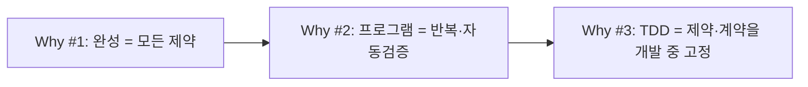

# 4x4 magic square problem observation
_Exported on 5/28/2026 at 14:04:46 GMT+9 from Cursor (3.5.38)_

---

**User**

당신은 문제 정의 전문가입니다.
나는 4x4 Magic Square 프로그램을 만들려고 합니다.
하지만 바로 설계하거나 구현하지 마십시오.
먼저 문제 인식 단계부터 진행하십시오.
--------------------------------------------
STEP 1 — Observation (관찰)
--------------------------------------------
다음 질문에 답하십시오:
1. 현재 우리가 해결하려는 상황은 무엇인가?
2. 왜 4x4 마방진 문제를 다루는가?
3. 이 문제는 어떤 학습 또는 시스템 설계 맥락에서 등장하는가?
“마방진을 만든다”는 표현 대신,상황을 관찰 관점으로 서술하십시오.


---

**Cursor**

프로젝트 맥락을 파악한 뒤 관찰 단계에 답하겠습니다.


# STEP 1 — Observation (관찰)

워크스페이스(`MagicSquare_`)에는 아직 코드나 문서가 없습니다. 따라서 아래는 **지금 주어진 신호**(프로젝트 이름, 4×4 제약, “프로그램”이라는 표현)만으로 관찰한 내용입니다.

---

## 1. 현재 우리가 해결하려는 상황은 무엇인가?

**한 사람이 4×4 격자에 1부터 16까지의 정수를 배치했을 때, 행·열·대각선 합이 모두 같은지 확인·탐색·생성하는 과정을 컴퓨터로 자동화하려는 상황**입니다.

관찰 관점으로 풀면:

- **입력**: 4×4 격자(또는 1~16 숫자 집합), 때로는 “빈 칸” 또는 “일부만 채워진 상태”
- **규칙**: 각 행, 각 열, 두 대각선의 합이 동일해야 함(4×4 표준 마방진에서는 그 합은 34)
- **출력 기대**: 규칙을 만족하는 배치, 만족 여부 판정, 또는 “가능한 배치를 찾아 보여 주는” 결과
- **맥락**: 사람이 손으로 채우거나 검산하는 대신, **반복·조합·검증**을 프로그램에 맡기려는 의도

즉, “마방진을 만든다”가 아니라 **“16개의 서로 다른 정수를 4×4에 놓았을 때, 여러 방향의 합이 동시에 맞는 배치를 다루는 상황”**을 다루려는 것입니다.

---

## 2. 왜 4×4 마방진 문제를 다루는가?

관찰 가능한 이유는 여러 층으로 나뉩니다.

| 관점 | 관찰 |
|------|------|
| **규모** | 3×3보다 조합·제약이 늘고, 5×5 이상보다는 다루기 쉬움 → **알고리즘·UI·테스트를 한 프로젝트 안에 넣기 좋은 크기** |
| **수학** | 짝수 차 마방진(4×4)은 홀수 차와 **생성·증명 방식이 다름** → “일반 n×n”보다 **별도 문제로 인식**되는 경우가 많음 |
| **학습** | 배열, 순열, 백트래킹, 불변식(합=34), 대칭·회전 등 **프로그래밍 기초 개념을 한 주제에 묶기**에 적합 |
| **실용(약함)** | 퍼즐·게임·교육용 도구처럼 **규칙 검증 + 탐색** 패턴을 연습하는 미니 시스템으로 쓰이기 쉬움 |

정리하면, 4×4는 **“너무 작지도 않고, 손으로도 막히고, 코드로는 여전히 전수·휴리스틱·공식 생성이 모두 의미 있는”** 경계 구간에 있습니다. 그래서 이 크기를 골랐을 가능성이 큽니다.

---

## 3. 이 문제는 어떤 학습 또는 시스템 설계 맥락에서 등장하는가?

### 학습 맥락

- **자료구조**: 2차원 배열, 인덱스(행/열/대각선)
- **알고리즘**: 완전 탐색, 가지치기, 백트래킹, (선택) 짝수 차 마방진 구성법
- **불변식·검증**: “합이 34인가”, “1~16이 한 번씩인가”
- **추상화**: “판정기 / 생성기 / 퍼즐 솔버” 역할 분리 연습

### 시스템 설계 맥락

작은 프로그램이라도 보통 아래 **역할**이 갈립니다(아직 설계하지 않음, 관찰만):

```
[사용자/입력] → [배치 또는 부분 입력] → [검증·탐색·생성] → [결과·설명]
```

- **검증 서브문제**: 주어진 4×4가 규칙을 만족하는지
- **생성 서브문제**: 규칙을 만족하는 하나 또는 여러 배치를 내는지
- **솔버 서브문제**: 일부 칸만 주어졌을 때 나머지를 채우는지
- **표현 서브문제**: 회전·대칭으로 “같은 해”를 어떻게 취급할지

프로젝트 폴더 이름(`MagicSquare_`)은 **도메인(마방진)을 중심으로 한 단일 목적 애플리케이션**을 염두에 둔 신호로 읽을 수 있습니다. 아직 요구사항 문서는 없으므로, **교육용 데모 / CLI 도구 / 퍼즐 앱 / 라이브러리** 중 어디에 가까운지는 다음 단계(요구·이해관계자·성공 기준)에서 좁혀야 합니다.

---

## 관찰 요약 (한 문장)

**“4×4에 1~16을 배치할 때, 여러 방향의 합이라는 동시 제약을 만족하는 상태를 사람이 아닌 프로그램이 다루게 하려는 상황”**이며, 그 이유는 **학습·연습에 적당한 난이도**와 **짝수 차 마방진이라는 별도 수학·알고리즘 이슈**가 겹치기 때문으로 보입니다.

---

다음 단계(STEP 2 — Problem framing / 이해관계자·성공 기준)로 넘어가려면, 아래 중 무엇에 가깝은지 알려주시면 관찰을 더 구체화할 수 있습니다.

- 규칙 **검증**만?
- **하나 생성**?
- **모든 해** 또는 **대표 해** 나열?
- **빈 칸 퍼즐** 풀이?

---

**User**

--------------------------------------------
STEP 2 — Why #1
--------------------------------------------
Q: 왜 마방진을 완성해야 하는가?
A를 가정하여 답하고, 그 답에서 드러나는 불편함 또는 구조적 문제를 분석하십시오.


---

**Cursor**

# STEP 2 — Why #1

## 가정한 답 (A)

**“4×4 격자에 1~16을 놓았을 때, 행·열·대각선 합이 모두 같다는 조건을 만족하는 ‘완성 상태’를 얻어야, 그 배치가 올바른지 판단하거나 퍼즐·과제·시험 요구를 충족할 수 있기 때문이다.”**

즉, **완성 = 규칙을 모두 만족하는 유일한(또는 허용된) 종착 상태**이고, 그 전에는 “맞다/틀리다”를 단정할 수 없다는 전제입니다.

---

## 이 답에서 드러나는 불편함

### 1. “완성”과 “맞음”이 한 번에 묶임

- 사용자 입장에서는 **중간 과정**(일부만 채운 판)도 의미 있는데, 시스템은 **16칸이 다 찬 뒤에만** “완성”을 인정할 수 있습니다.
- 불편: 한 칸만 틀려도 “거의 맞음”과 “전혀 다름”이 같은 **미완성**으로 취급되거나, 반대로 합만 우연히 맞는 **가짜 완성**을 구분하기 어렵습니다.

### 2. 완성 목표가 하나로 고정되지 않음

같은 “완성해야 한다”는 말도 목적이 갈립니다.

| 목적 | “완성”이 의미하는 것 |
|------|---------------------|
| 학습·증명 | **아무 하나**의 유효 배치면 충분 |
| 퍼즐 | **주어진 힌트와 맞는** 그 해 하나 |
| 탐구 | **서로 다른 해 전부** 또는 대표 집합 |
| 시각·발표 | **보기 좋은 / 대칭적인** 한 배치 |

- 불편: Why #1의 답은 “완성”으로 들리지만, **어떤 완성을 원하는지**가 빠져 있어 요구가 흔들립니다.

### 3. 사람의 검증 방식과 프로그램의 검증 방식이 어긋남

- 사람은 종종 **한 줄 합만** 보거나, **대각선은 나중에** 확인합니다.
- “완성해야 한다”는 압박은 **전 제약 동시 만족**을 전제로 하는데, 학습자는 **순차·부분 검증**을 기대합니다.
- 불편: “완성 전에는 쓸모없다” vs “단계별 피드백이 필요하다”가 충돌합니다.

### 4. 4×4에서 “완성”이 항상 어렵지는 않음

- 4×4 마방진은 **구성 방법·해의 개수**가 알려져 있어, “완성”이 **탐색의 어려움**이 아니라 **규칙 암기·패턴 적용** 문제로 느껴질 수 있습니다.
- 불편: Why가 “어려운 퍼즐을 풀기 위해”인지 “**규칙 준수 여부를 기계적으로 확인**하기 위해”인지에 따라, 완성을 **목표**로 둘지 **검증의 부산물**로 둘지 설계가 달라집니다.

---

## 구조적 문제 (설계·문제 정의 관점)

### 구조 1: 종착 상태 중심 vs 과정 중심

```
[빈 판 / 부분 입력] ──?──> [완성 판] ──> [합격/불합격]
```

- Why #1이 **종착 상태(완성)**만 강조하면, **과정 상태**(몇 개 제약 만족, 어디가 틀렸는지)에 대한 개념이 빈약해집니다.
- 결과: 솔버·튜터·채점기 중 **무엇을 만들지**가 Why 단계에서 갈라지지 않고 남습니다.

### 구조 2: 단일 “정답” 환상

- “완성해야 한다”는 표현은 **정답이 하나**인 것처럼 들리지만, 4×4 마방진은 **회전·대칭·동일 합 구조** 때문에 “같은 해의 다른 표현”이 많습니다.
- 구조적 문제: **완성 = 동일 배치**인지 **완성 = 동일 제약 만족(동치류)**인지 정의가 없으면, 채점·비교·저장이 모호해집니다.

### 구조 2′: 제약의 계층이 숨겨짐

완성에는 보통 여러 층이 있습니다.

1. 1~16 각각 한 번 (순열)
2. 각 행 합 = 34
3. 각 열 합 = 34
4. 대각선 합 = 34

- Why가 “합이 같으면 된다”로만 묶이면, **어느 제약을 먼저/필수로** 볼지가 없어 **가지치기·힌트·오류 메시지** 설계가 뒤틀립니다.

### 구조 3: “완성”의 책임 주체

| 주체 | 완성의 의미 |
|------|-------------|
| 사용자 | 직접 칸을 채워 끝냄 |
| 프로그램 | 알고리즘이 배치를 출력 |
| 둘 다 | 사용자가 시작, 프로그램이 나머지 채움 |

- 같은 Why #1 답이라도 **누가 완성하는가**에 따라 불필요한 기능(생성기 vs 에디터 vs 솔버)이 생깁니다.
- 구조적 문제: **목적(왜 완성)**과 **행위 주체(누가 완성)**가 분리되지 않은 채 요구가 쌓이기 쉽습니다.

---

## Why #1 정리 (가정 A 기준)

| 항목 | 내용 |
|------|------|
| **가정한 이유** | 규칙을 모두 만족하는 종착 상태만이 “올바름”과 과제 충족을 동시에 보장한다 |
| **핵심 불편** | 완성 전 피드백 부재, “완성”의 목적·해의 동치 혼동, 사람의 단계적 검증과 전역 검증의 불일치 |
| **핵심 구조 문제** | 종착 상태 중심 문제 정의, 단일 정답 가정, 제약 계층·주체(사람/기계) 미분리 |

---

다음 **STEP 2 — Why #2**에서는 보통 **“완성하지 않으면 무엇이 안 되는가?”**(실패 비용) 또는 **가정 A를 바꾼 대안 Why**(예: “학습을 위해 과정 피드백이 필요하다”)를 두고 같은 방식으로 쪼개는 것이 자연스럽습니다. 원하시면 Why #2도 같은 형식으로 이어가겠습니다.

---

**User**

--------------------------------------------
STEP 3 — Why #2
--------------------------------------------
Q: 왜 단순 계산이 아니라 프로그램으로 구현하는가?
다음 관점에서 답하십시오:
- 반복 가능성
- 검증 자동화
- 오류 방지
- 규칙 기반 사고 훈련


---

**Cursor**

# STEP 3 — Why #2

## 질문

**왜 손계산·종이·계산기 수준으로 두지 않고, 프로그램으로 다루는가?**

STEP 2에서 가정한 맥락(4×4에 1~16을 배치하고, 행·열·대각선 합 등 **여러 제약을 동시에** 만족하는지 다루는 상황)을 전제로, 네 가지 관점에서 답합니다.

---

## 1. 반복 가능성 (Repeatability)

### 답

같은 규칙·같은 입력에 대해 **언제, 누가 실행해도 동일한 절차와 결과**를 얻으려면, 손검산은 변동이 크고 프로그램은 절차를 고정하기 쉽기 때문입니다.

### 관찰

| 손으로 할 때 | 프로그램으로 할 때 |
|--------------|----------------------|
| 피로·순서 바뀜·누락으로 매번 검산 경로가 달라짐 | 검증·생성·출력 순서를 **한 번 정의하면 재현** |
| “또 하나만 찾아 보기”가 번거로워 탐색을 줄임 | 수천·수만 번의 시도·나열을 **부담 없이 반복** |
| 실험(입력 바꿔 보기)마다 기록을 새로 적어야 함 | 입력만 바꿔 **동일 파이프라인** 재실행 |

4×4는 칸이 16개라 손으로도 *한 번* 검산은 가능하지만, **여러 배치 비교**, **부분 입력에 대한 후보 탐색**, **교육용 예제를 10가지 바꿔 돌리기** 같은 일은 반복 비용이 커집니다. 프로그램은 “규칙을 만족하는가?”를 **동일한 기준으로 N번** 묻는 도구에 가깝습니다.

### 드러나는 구조적 이슈

- 반복 가능성을 목표로 하면, 곧 **“무엇을 입력으로 고정할 것인가”**(완성 판만 vs 부분 판 vs 시드)가 필요해집니다. Why #1의 “완성”과 맞물려, **반복 단위**(한 해 / 모든 해 / 매 시도)가 정의되지 않으면 프로그램의 가치가 흐려집니다.

---

## 2. 검증 자동화 (Verification Automation)

### 답

행·열·대각선 합, 중복 숫자, 범위(1~16) 등 **여러 조건을 매번 전부** 확인해야 하는데, 사람은 일부만 보고 “완성”이라고 착각하기 쉽고, 프로그램은 **모든 제약을 한꺼번에** 기계적으로 판정할 수 있기 때문입니다.

### 관찰

손검산의 전형적 패턴:

1. 행 합만 맞는지 본다  
2. 열은 나중에 본다  
3. 대각선을 빼먹는다  
4. 숫자 중복은 눈으로 놓친다  

자동 검증은 대략 다음을 **명시적 규칙**으로 바꿉니다.

```
∀행: sum(행) = 34
∀열: sum(열) = 34
∀대각선: sum(대각선) = 34
∀숫자: 1..16에 속하고 서로 다름
```

- **판정**: 합격/불합격을 즉시  
- **진단**(설계 여지): 어떤 제약이 깨졌는지 목록  
- **채점·튜터·CI**처럼 사람 개입 없이 같은 기준 적용  

STEP 2에서 말한 **“종착 상태만이 옳다”**는 압력을, 프로그램은 **“전 제약 동시 검사”**로 구현하기 쉽습니다. 반대로, 학습자가 원하는 **단계별 피드백**도 자동화하면 “행만 맞음” 같은 중간 상태를 **의도적으로** 노출할 수 있습니다.

### 드러나는 구조적 이슈

- 검증 자동화만으로는 **생성·탐색·설명**은 해결되지 않습니다. “맞는지 판단”과 “맞는 것을 찾기”는 다른 Why이며, 후자를 넣으면 범위가 커집니다.  
- 회전·대칭 동치를 “같은 해”로 볼지는 **자동 비교 규칙**을 또 정해야 합니다.

---

## 3. 오류 방지 (Error Prevention)

### 답

합산 실수, 같은 숫자 두 번 넣기, 칸 잘못 읽기 같은 **인지·산술 오류**를 줄이고, 규칙 위반을 **실행 전·입력 시·검증 시**에 막거나 빨리 드러내기 위해서입니다.

### 관찰

| 오류 유형 | 손작업 | 프로그램이 줄이는 방식 |
|-----------|--------|-------------------------|
| 산술 (34가 아님) | 계산 착오 | 합을 코드로 계산 |
| 논리 (중복·빠진 수) | 눈으로 놓침 | 집합·카운트로 검사 |
| 절차 (대각선 미검) | 습관·피로 | 검증 목록을 빠짐없이 실행 |
| 탐색 (불가능한 가지) | 시간 낭비 | 가지치기·불변식으로 조기 차단 |

4×4는 “한 번만 조심하면” 손으로도 맞출 수 있어, **오류 방지**만으로는 프로그램 필요성이 약해 보일 수 있습니다. 가치는 **반복·부분 입력·여러 사용자·시간 제한**이 붙을 때 커집니다. 예: 퍼즐 앱, 자동 채점, 대량 테스트 데이터 생성.

### 드러나는 구조적 이슈

- 프로그램도 **버그·잘못된 규칙 구현**으로 “틀린 채로 맞다”고 할 수 있습니다. 오류 방지는 **사람 실수 → 규칙의 단일 구현**으로 옮기는 것이지, 오류 제거가 아닙니다.  
- 입력 UI가 없으면 사용자는 여전히 **잘못된 배열을 파일/콘솔에 넣는 실수**를 합니다. “방지”는 검증·제약 입력 설계까지 포함합니다.

---

## 4. 규칙 기반 사고 훈련 (Rule-Based Thinking)

### 답

마방진을 “감으로 채우는 그림”이 아니라 **명시적 규칙·불변식·단계**로 분해해 다루는 연습을 하기 위해서입니다. 프로그램은 그 규칙을 **실행 가능한 형태**로 고정하는 매개체입니다.

### 관찰

손계산은 종종 암묵적입니다.

- “합이 34여야 한다”  
- “모서리/중앙 패턴” (4×4 구성법을 아는 경우)  
- “이 칸에 이 수는 안 된다” (직관)

프로그램화를 요구하면 보통 다음으로 **언어화**해야 합니다.

1. **상태**: 4×4, 각 칸의 값 또는 빈 칸  
2. **규칙**: 허용/금지 조건 (합, 중복, 범위)  
3. **전이**: 빈 칸에 수를 넣거나 되돌리기  
4. **종료**: 모든 제약 만족 (STEP 2의 “완성”)  
5. **전략**(선택): 전수, 가지치기, 짝수 차 구성법  

이는 **알고리즘·논리·테스트** 학습과 직결됩니다. “규칙을 코드와 테스트로 쓴다” = “말로만이 아니라 검증 가능하게 쓴다”는 훈련입니다.

### 드러나는 구조적 이슈

- 훈련 목표가 **구현 연습**인지 **수학 이해**인지에 따라, 프로그램은 **최소 검증기**일 수도 **풀 솔버**일 수도 있습니다. 후자는 Why #2(반복·자동화)를 강화하지만, 학습 범위가 커집니다.  
- 규칙을 너무 일찍 “4×4 전용 트릭” 하나로 고정하면, **일반화( n×n )** 훈련과 충돌할 수 있습니다. 4×4를 **경계 사례가 있는 작은 도메인**으로 둘지 정해야 합니다.

---

## 네 관점을 한 줄로 묶은 Why #2

| 관점 | Why 프로그램인가 (요약) |
|------|-------------------------|
| 반복 가능성 | 같은 규칙으로 많은 판·시도·실험을 **동일 절차**로 반복 |
| 검증 자동화 | 다중 제약을 **빠짐없이·일관되게** 판정 (필요 시 진단) |
| 오류 방지 | 합산·중복·누락 검사 등 **인지 부담을 기계에 이양** |
| 규칙 기반 사고 | 암묵적 퍼즐 감각을 **명시 규칙·상태·전이**로 표현·실행 |

**통합 가정 (Why #2의 A):**  
4×4 제약 문제는 “한 번 계산”이 아니라 **반복 검사·다양한 입력·명시적 규칙**이 핵심이라, 손계산은 신뢰성과 확장에 한계가 있고, 프로그램은 그 한계를 **절차·판정·표현**으로 메우는 수단이다.

---

## Why #1과 Why #2의 접점 (구조 메모)

```
Why #1: 완성(모든 제약 만족) 상태가 필요하다
         ↓
Why #2: 그 완성·준완성·후보를 손으로 반복 검증하기엔
         → 반복·자동검증·실수 감소·규칙 명시화가 프로그램을 정당화
```

여전히 **열린 선택**:

- **검증만** 하는 최소 프로그램 vs **생성·탐색까지** 하는 프로그램  
- **교육용(규칙 훈련)** vs **도구용(오류 방지·자동화)** 중 무엇을 1순위로 둘지  

다음 단계(STEP 4 등)에서는 이 네 관점 중 **우선순위 하나**를 정하면, 범위가 크게 줄어듭니다. 원하시면 STEP 4에서 “검증기만 / 생성 포함 / 튜터링” 중 가정을 하나 잡고 같은 방식으로 쪼개겠습니다.

---

**User**

--------------------------------------------
STEP 4 — Why #3 (핵심 발견)
--------------------------------------------
Q: 왜 이 문제를 TDD 방식으로 설계하려 하는가?
- 무엇이 통제되어야 하는가?
- 어떤 불변 조건이 존재하는가?
- 왜 입력/출력이 명확해야 하는가?


---

**Cursor**

# STEP 4 — Why #3 (핵심 발견)

## 질문

**왜 4×4 마방진 문제를 TDD 방식으로 설계·구현하려 하는가?**

STEP 2(완성·종착 상태), STEP 3(반복·자동 검증·규칙 명시)와 연결하면, TDD는 “테스트를 먼저 쓰는 습관”이 아니라 **규칙이 많고 판정이 명확한 도메인에서, 무엇을 통제하고 무엇을 고정할지를 먼저 밖으로 꺼내는 설계 방식**에 가깝습니다.

---

## 가정한 답 (A)

**마방진은 수학적 불변식과 다중 제약이 겹쳐서, 구현이 조금만 어긋나도 “그럴듯하지만 틀린” 결과가 나오기 쉽다. TDD는 그 제약들을 테스트로 고정해, 기능 추가(검증 → 생성 → 힌트) 순서가 바뀌어도 회귀 없이 규칙을 지키게 하려는 선택이다.**

---

## 1. 무엇이 통제되어야 하는가?

### 통제 대상 (도메인)

| 통제 영역 | 통제하고 싶은 것 | TDD가 돕는 이유 |
|-----------|------------------|-----------------|
| **판정 기준** | “마방진인가?”의 정의가 흔들리지 않음 | 테스트가 **합격/불합격의 계약**이 됨 |
| **제약 순서** | 행만 보고 통과시키는 등 부분 검증 누락 | 각 제약별 테스트로 **빠짐없이** 강제 |
| **경계** | 크기 4×4, 값 1~16, 정수만 | 잘못된 입력에 대한 **거부·예외** 고정 |
| **동치** | 회전·대칭을 같은 해로 볼지 | 비교 규칙을 테스트로 **명시** (안 하면 암묵적) |
| **범위 확장** | 검증만 vs 생성·탐색까지 | 작은 테스트부터 쌓아 **기능 폭주** 완화 |
| **회귀** | 리팩터·최적화 후에도 규칙 유지 | 한 번 녹인 규칙이 **깨지면 즉시 실패** |

### 통제 대상 (프로세스)

STEP 3에서 말한 **반복 가능성·검증 자동화**는 “실행할 때마다 같은 결과”를 요구합니다. TDD는 그걸 **개발 단계**로 끌어올립니다.

- 사람의 손검산 변동 → **CI/로컬에서 동일 테스트 스위트**
- “대각선은 나중에” → **테스트 목록에 대각선이 없으면 배포 불가**
- 구현자의 착각 → **RED → GREEN → REFACTOR**로 “의도한 규칙”만 코드에 남김

### 드러나는 구조적 문제

통제하려면 먼저 **책임 단위**가 나뉘어야 합니다. 하나의 `isMagic()`에 모든 것을 넣으면 테스트도 덩어리가 되어 실패 원인이 불명확합니다. TDD를 택했다는 것은 곧 **검증을 층(행/열/대각/중복/범위)으로 쪼개 통제**하겠다는 선언에 가깝습니다.

---

## 2. 어떤 불변 조건이 존재하는가?

불변 조건 = **어떤 연산·탐색·리팩터를 해도 깨지면 안 되는 성질**. 4×4 마방진에서는 테스트로 박아 두기 좋은 것이 많습니다.

### (A) 입력·구조 불변

| 불변 | 내용 |
|------|------|
| **격자 형태** | 항상 4행×4열 |
| **값 집합** | 완성 상태에서는 `{1,…,16}` 각각 정확히 1회 (순열) |
| **값 범위** | 모든 칸 ∈ [1, 16] (정수) |

### (B) 산술 불변 (4×4 표준)

| 불변 | 내용 |
|------|------|
| **마법 상수** | n=4일 때 행/열/대각 **유효 합 = 34** (1+…+16)/4 |
| **행** | ∀i: sum(행 i) = 34 |
| **열** | ∀j: sum(열 j) = 34 |
| **대각** | 주대각·부대각 합 = 34 |

### (C) 논리·도메인 불변

| 불변 | 내용 |
|------|------|
| **판정 일관성** | 모든 (B) 만족 ⇔ `isValidMagicSquare` true (정의에 따라 (A) 포함) |
| **부분 상태** (퍼즐/솔버 도입 시) | 이미 채운 칸은 변경하지 않음; 빈 칸만 채움 |
| **탐색** (생성/백트래킹 시) | 후보를 넣은 뒤에도 **깨진 제약은 더 깊이 가지 않음** (가지치기 불변) |

### (D) 동치·대칭 (정책 불변 — 정해야 하는 것)

| 선택 | 불변 예시 |
|------|-----------|
| **엄격 동일** | 배열 원소가 완전히 같을 때만 같은 해 |
| **대칭 동치** | 회전·반사 후 같으면 같은 해 |

이건 수학 “자연 불변”이 아니라 **제품 규칙**입니다. TDD로 하면 “우리는 D 중 무엇을 채택한다”를 **테스트 한 세트**로 고정합니다. STEP 2의 “단일 정답 환상”이 여기서 해소되거나, 의도적으로 남습니다.

### TDD와 불변 조건의 관계

```
불변 조건  →  실패하면 안 되는 assert
            →  RED일 때 “무엇을 구현해야 하는지”가 분명
            →  REFACTOR 시 “행 검증만 분리해도 합은 여전히 34” 같은 구조 유지
```

**핵심 발견:** 마방진 문제는 **불변 조건이 풍부하고 대부분 기계적으로 검사 가능**해서, TDD의 이점(명세=테스트)이 크고, 반대로 불변을 정의하지 않으면 구현이 감각·출력 예쁨에 기대기 쉽습니다.

---

## 3. 왜 입력/출력이 명확해야 하는가?

### 답 (요약)

테스트는 **같은 입력 → 같은 기대 출력**이 없으면 작성할 수 없습니다. 마방진은 겉보기엔 “4×4 배열” 하나지만, 실제로는 **입력 종류·출력 의미**가 여러 갈래라서, TDD 전에 계약을 박아 두지 않으면 RED/GREEN 자체가 흔들립니다.

### 입력이 모호할 때 생기는 일

| 모호한 입력 | 문제 |
|-------------|------|
| 4×4인데 빈 칸 허용? | 검증기 vs 솔버가 다른 함수인데 하나로 섞임 |
| 0 또는 “.” = 빈 칸? | 파싱·테스트 픽스처마다 다른 표현 |
| 3×3 배열도 받음? | n=4 고정인지 일반화인지 범위 불명 |
| “거의 맞는” 판 | bool만 반환 vs 진단 리스트 — **출력 타입**이 달라짐 |

### 출력이 모호할 때 생기는 일

| 모호한 출력 | 문제 |
|-------------|------|
| `true/false`만 | **어느 제약이 깨졌는지** 테스트 불가 (STEP 2의 과정 피드백 요구와 충돌) |
| 해 하나 출력 | **동치 해**와 다른 배열이면 실패할지 애매 |
| “아무 마방진” | 시드·결정론·재현성(STEP 3) 테스트 불가 |
| 예외 vs `false` | 잘못된 크기 — 테스트가 구현마다 달라짐 |

### TDD가 요구하는 최소 계약 (4×4 1차 범위 예시)

명세 단계에서라도 이런 식으로 **한 줄씩** 고정하는 것이 좋습니다.

| 기능 (가정) | 입력 (명확) | 출력 (명확) |
|-------------|-------------|-------------|
| 완성 판 검증 | `int[4][4]`, 모든 칸 1~16 | `boolean` 또는 `ValidationResult{ok, violations[]}` |
| 행/열/대각만 | 동일 | `boolean` (부분 검증 API) |
| 잘못된 크기 | `int[3][3]` | `IllegalArgumentException` 또는 `ValidationResult.invalid` |
| (후순위) 생성 | 없음 또는 `seed` | `int[4][4]` 결정론적 |

**왜 명확해야 하나 (TDD 관점 4가지)**

1. **테스트가 문서** — 입출력이 곧 API 계약  
2. **실패 메시지** — 기대 `sum row0=34` vs 실제 `32`처럼 디버깅 가능  
3. **단계적 구현** — “행 합만” 테스트 → “열 추가” → “대각 추가” 순서 (통제)  
4. **가짜 구현 방지** — `return true`로 GREEN 치는 걸 막으려면 **반례 입력**이 명확해야 함  

STEP 2의 **종착 상태 중심**과 STEP 3의 **자동 검증**은, TDD에서는 **bool 검증 테스트 + 알려진 반례 판 + 알려진 정답 판(고전 4×4 예제)** 세트로 먼저 고정하는 패턴과 맞습니다.

---

## Why #3 통합 (핵심 발견)

| 질문 | 핵심 |
|------|------|
| **무엇을 통제?** | 판정 정의, 제약 누락, 경계, 동치 정책, 기능 확장·회귀 |
| **불변 조건?** | 4×4, 1~16 순열, 합=34(행·열·대각), (선택) 탐색·부분판 규칙, (정책) 동치 |
| **입출력 명확성?** | 테스트 가능한 계약; 검증/생성/진단 분리; 반례·재현성 |

**한 문장:**  
마방진은 **규칙이 테스트로 옮기기 좋은 도메인**이고, TDD는 Why #1(완성=전 제약)·Why #2(자동·반복·오류 방지)를 **개발 과정에서도 동일하게 유지**하기 위한 설계 선택이다. 반대로 입출력·동치·진단 depth를 정하지 않으면 TDD는 **테스트만 많은 모호한 스펙**이 됩니다.

---

## 이전 Why와의 연결



**STEP 4에서 열린 결정 (TDD 착수 전):**

1. 1차 목표: **검증만** vs **생성 포함**  
2. 실패 시: **boolean** vs **위반 목록**  
3. 동치: **엄격 배열 비교** vs **정규형(회전 표준화) 후 비교**  

원하시면 STEP 5에서 위 세 가지에 **가정 A/B를 각각 잡고**, “첫 RED 테스트 3개” 수준까지는 **설계 없이** 명세만 쪼개겠습니다.

---

**User**

--------------------------------------------
STEP 5 — 진짜 문제 정의
--------------------------------------------
다음을 작성하십시오:
1. 표면 문제 정의 (잘못된 정의)
2. 개선된 문제 정의 (정확한 정의)
3. 이 문제의 핵심 Invariant
4. 우리가 실제로 훈련하려는 사고 능력
−	구현 설계는 하지 마십시오.
−	코드 언급 금지.
−	알고리즘 설명 금지.
−	구조화된 Markdown으로 작성하십시오.
```


---

**Cursor**

# STEP 5 — 진짜 문제 정의

---

## 1. 표면 문제 정의 (잘못된 정의)

> **4×4 격자에 1부터 16까지 숫자를 넣어, 행·열·대각선의 합이 모두 같은 마방진을 만드는 프로그램을 만든다.**

### 왜 잘못된 표현인가

| 함정 | 설명 |
|------|------|
| **행위만 강조** | “만든다”는 말이 **생성**만 떠올리게 하고, **판정·진단·부분 상태·반복 실험**은 빠짐 |
| **목표가 하나처럼 보임** | “맞는 배치 하나”인지, “모든 배치”인지, “주어진 힌트에 맞는 배치”인지 불명 |
| **완성만이 성공** | 16칸이 다 찬 뒤에만 의미가 있다고 읽히며, **학습·검증 과정**이 사라짐 |
| **도구 수준 미정** | 손계산·종이·계산기로도 한 번은 가능한 일을, **왜 프로그램·왜 반복·왜 규칙 고정**인지 드러나지 않음 |
| **정답 환상** | 배치가 하나인 것처럼 들리나, **같은 제약을 만족하는 여러 표현**(대칭·회전 등)과의 관계가 없음 |
| **TDD·품질 누락** | 무엇을 통제하고, 무엇이 절대 깨지면 안 되는지 없이 “기능 목록”으로 끝남 |

표면 정의는 **퍼즐 완성 게임**으로만 읽히고, 우리가 STEP 1~4에서 드러낸 **상황·이유·통제**와 맞지 않는다.

---

## 2. 개선된 문제 정의 (정확한 정의)

> **4×4에 1~16을 각각 한 번씩 배치했을 때, 행·열·두 대각선의 합이 모두 동일한지(및 그에 필요한 모든 조건을) 사람의 반복 검산에 의존하지 않고, 명시된 규칙으로 일관되게 판단·기록·반복할 수 있게 한다. 필요 시, 규칙을 만족하는 배치를 찾거나, 주어진 부분 배치에 맞는 완성 상태까지 다룬다. 개발과 운용 전 과정에서 “무엇이 맞는 판인가”의 기준이 흔들리지 않도록, 그 기준을 검증 가능한 형태로 고정한다.**

### 정의를 구성하는 요소

| 요소 | 내용 |
|------|------|
| **대상** | 4×4 격자 위 1~16의 배치(완성 또는 부분) |
| **핵심 과제** | 다중 제약(합 동일, 숫자 중복 없음, 범위·크기)을 **빠짐없이** 적용하는 판정과, 동일 기준의 **반복** |
| **프로그램의 역할** | 손계산 변동·누락·피로를 줄이고, 규칙을 **한 곳에 명시**해 누구나 같은 결론에 도달하게 함 |
| **종착 상태** | 모든 제약을 동시에 만족하는 배치(STEP 2의 “완성”)—단, **유일한 그림**이 아니라 **제약 만족**이 기준 |
| **품질 목표** | 기준 추가·변경 시에도 이전에 합의한 판정이 깨지지 않음(TDD·불변·명확한 입출력 계약의 이유) |
| **범위 경계** | 1차는 **판정(및 필요 시 진단)**을 중심으로 두고, 생성·퍼즐 풀이는 **같은 규칙 체계 위의 확장**으로 본다(표면 정의처럼 “만들기만”이 아님) |

### 성공 기준 (문제가 풀렸다고 말할 수 있는 조건)

- 주어진 완성 배치에 대해, **맞음/틀림**이 항상 같고 설명 가능하다.
- 틀린 경우, **어느 종류의 위반**인지(합·중복·범위·형태 등) 구분할 수 있다(진단을 넣기로 한 경우).
- 같은 입력을 여러 번 다뤄도 **같은 결론**이 나온다.
- “완성”의 의미(전 제약 동시 만족)가 문서·검증·사용자 기대와 **일치**한다.

---

## 3. 이 문제의 핵심 Invariant

**Invariant** = 어떤 단계·확장·변경이 있어도 반드시 유지되어야 하는 성질.

### 구조·데이터

| ID | 불변 | 설명 |
|----|------|------|
| I1 | **격자 크기** | 대상은 항상 4행×4열이다. |
| I2 | **값 범위** | 각 칸의 값은 1 이상 16 이하의 정수이다. |
| I3 | **완성 시 순열** | 완성 상태에서는 1~16이 **정확히 한 번씩**만 나타난다(중복·누락 없음). |

### 산술·제약 (4×4 표준)

| ID | 불변 | 설명 |
|----|------|------|
| I4 | **마법 상수** | 유효한 완성 상태에서 행·열·대각의 공통 합은 **34**이다. |
| I5 | **행 합** | 모든 행의 합이 34이다. |
| I6 | **열 합** | 모든 열의 합이 34이다. |
| I7 | **대각 합** | 주대각선·부대각선의 합이 각각 34이다. |

### 판정·논리

| ID | 불변 | 설명 |
|----|------|------|
| I8 | **판정 일관성** | I3~I7(및 I1~I2)을 모두 만족할 때만 “유효한 완성 배치”이다; 하나라도 어기면 유효하지 않다. |
| I9 | **부분 위반 전파** | 부분 배치에서 이미 I2·I3(해당 칸에 대해) 또는 이미 확정된 합 제약을 깨면, 그 가지는 유효한 완성으로 이어질 수 없다(탐색·퍼즐 확장 시). |
| I10 | **재현성** | 동일한 입력(배치·규칙 세트·동치 정책)에 대해 판정 결과는 항상 동일하다. |

### 정책·계약 (의도적으로 정해야 하는 불변)

| ID | 불변 | 설명 |
|----|------|------|
| I11 | **입력 계약** | 무엇을 “한 판”으로 받는지(완성만 / 빈 칸 허용 / 잘못된 크기 처리)가 정해져 있고, 범위 밖 입력은 정의된 방식으로 거부된다. |
| I12 | **출력 계약** | 판정 결과(및 선택적 진단)의 의미가 고정되어, “맞다”가 부분 검사 통과를 뜻하지 않는다. |
| I13 | **동치 정책** | 두 배치를 “같은 해”로 볼지(엄격 일치 vs 대칭·회전 후 동일)가 명시되어, 비교·채점이 흔들리지 않는다. |

**핵심:** I1~I8은 **도메인 불변**; I9~I13은 **문제를 프로그램·TDD로 다룰 때 반드시 밖으로 꺼내는 계약 불변**이다.

---

## 4. 우리가 실제로 훈련하려는 사고 능력

구현·알고리즘이 아니라, 이 문제를 매개로 길러지는 **인지·설계 사고**이다.

| 능력 | 훈련 내용 | 이 문제에서의 드러남 |
|------|-----------|----------------------|
| **다중 제약 동시 사고** | 하나의 조건(예: 행 합)만 맞다고 전체가 맞다고 결론 내지 않음 | 행·열·대각·중복을 **한 체계**로 본다 |
| **명시적 규칙화** | 암묵적 “감”을 말·검증 가능한 조건으로 쓸 수 있음 | “완성”을 **조건 목록**으로 정의한다 |
| **불변식 인식** | 변하지 않아야 하는 것(합 34, 1~16 한 번)과 변해도 되는 것(특정 배치 모양)을 구분 | I1~I8을 **기준축**으로 삼는다 |
| **계약·경계 설정** | 입력이 무엇일 때 의미가 있고, 출력이 무엇을 약속하는지 구분 | I11~I12; 표면 정의의 모호함을 제거 |
| **검증과 생성의 분리** | “맞는지 본다”와 “맞는 것을 찾는다”는 다른 문제임을 인지 | STEP 2·개선 정의의 범위 경계 |
| **동치·표현 독립** | 같은 제약 만족이 여러 배치로 나타날 수 있음을 인지 | I13; “정답 그림 하나” 환상 극복 |
| **반복·재현에 대한 태도** | 같은 실험을 신뢰할 수 있게 반복하고 기록함 | Why #2·I10 |
| **회귀·통제 의식** | 기준을 바꾸거나 기능을 넓혀도 이전 기준이 깨지지 않게 함 | Why #3·TDD 맥락의 “무엇을 통제할 것인가” |
| **진단적 사고** (선택) | 실패 시 “어디가 왜”인지 구조화 | 부분 통과와 전체 실패 구분 |

### 한 줄 요약

> **복잡한 규칙을 겹쳐 놓은 세계에서, “무엇이 절대 변하지 않는가”와 “무엇을 약속으로 고정할 것인가”를 분리해 생각하고, 그 기준으로 맞음·틀림을 일관되게 말할 수 있는 능력.**

---

## 표면 vs 개선 (대조)

| 구분 | 표면 | 개선 |
|------|------|------|
| 초점 | 결과물(마방진 그림) | **판정 기준·규칙 체계·재현 가능한 결론** |
| 성공 | 16칸 채움 | **전 제약 동시 만족**의 명확한 확인 |
| 도구 | 만들기 | **검증·반복·고정·(선택) 탐색** |
| 위험 | 정답 하나·손으로 충분 | **동치·부분 상태·계약** 미정으로 혼란 |

---

이 문서가 **진짜 문제 정의**이다. 다음 단계(사용자 시나리오, acceptance criteria, 첫 검증 명세)로 갈 때도 **구현·알고리즘 없이** 입출력 계약(I11~I12)과 1차 범위(검증 중심 vs 생성 포함)만 정하면 된다.

---

**User**

지금까지 작업한 내용을 Report 폴더에 보고서로 내보내줘

---

**Cursor**

지금까지의 문제 정의(STEP 1~5)를 `Report` 폴더에 Markdown 보고서로 정리합니다.


`Report` 폴더에 STEP 1~5 내용을 Markdown 보고서로보냈습니다.

## 위치

`c:\DEV\MagicSquare_\Report\`

## 파일 구성

| 파일 | 설명 |
|------|------|
| [README.md](c:\DEV\MagicSquare_\Report\README.md) | 목차·다음 단계 안내 |
| [Problem-Definition-Report.md](c:\DEV\MagicSquare_\Report\Problem-Definition-Report.md) | **통합 보고서** (STEP 1~5 전체) |
| [01-Observation.md](c:\DEV\MagicSquare_\Report\01-Observation.md) | STEP 1 — 관찰 |
| [02-Why-1.md](c:\DEV\MagicSquare_\Report\02-Why-1.md) | STEP 2 — Why #1 |
| [03-Why-2.md](c:\DEV\MagicSquare_\Report\03-Why-2.md) | STEP 3 — Why #2 |
| [04-Why-3-TDD.md](c:\DEV\MagicSquare_\Report\04-Why-3-TDD.md) | STEP 4 — Why #3 (TDD) |
| [05-Real-Problem-Definition.md](c:\DEV\MagicSquare_\Report\05-Real-Problem-Definition.md) | STEP 5 — 진짜 문제 정의 |

한 번에 읽으려면 **Problem-Definition-Report.md**를, 단계별로 보려면 **01~05**와 README 링크를 쓰면 됩니다. STEP 5와 동일하게 구현·코드·알고리즘 설명은 넣지 않았습니다.

---

**User**

하나의 파일로

---

**Cursor**

단일 보고서 파일로 통합하고, 나머지 분할 파일은 정리합니다.


통합 보고서에 목차와 STEP 5 상세를 보강한 뒤, 나머지 파일을 제거합니다.


`Report` 폴더에는 이제 **파일 하나**만 있습니다.

**경로:** `c:\DEV\MagicSquare_\Report\MagicSquare-Problem-Definition-Report.md`

STEP 1~5 전체, 목차, Why 체인, 부록, 다음 단계 안내가 모두 이 파일에 들어 있습니다. 이전에 나눠 두었던 README·통합본·01~05 파일은 제거했습니다.

